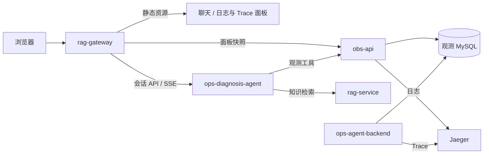

# rag-gateway

运维 Agent 项目的 Web 入口，提供诊断聊天、会话历史、工具调用与知识引用展示，以及日志和 Trace 联动观测面板。后端使用 Go + Gin 和标准库 `httputil.ReverseProxy`，前端使用原生 JavaScript 模块与 Canvas，无需前端构建步骤。

项目沿用 `rag-gateway` 名称，目前服务于完整的运维诊断流程：用户从图表中发现异常，框选时间范围并发送问题，查看 Agent 的证据收集过程和诊断结果。

## 在整个项目中的位置

[ops-agent](https://github.com/wang-kang-tuoinai/ops-agent) 由五个模块协作完成业务演练、观测和诊断：

| 模块 | 职责 |
| --- | --- |
| **`rag-gateway`** | 托管页面，代理会话和观测面板接口，提供统一浏览器入口 |
| `ops-diagnosis-agent` | LangGraph 诊断执行、模型与工具调用、会话持久化、SSE 输出 |
| `obs-api` | 日志/Trace 查询、统计分析及面板缓存快照 |
| `rag-service` | 项目架构、排查手册和中间件技术资料检索 |
| `ops-agent-backend` | 用户 CRUD 示例业务及故障演练对象，产生结构化日志和 Trace |



浏览器通过网关的同源 API 访问后端，不接触模型密钥，也不直接访问 MySQL 或 Jaeger。网关不负责模型推理、知识检索、日志聚合或 Trace 缓存刷新。

## 主要功能

### 诊断聊天

- 新建诊断时先打开空白草稿，首次发送再由服务端创建 UUID 会话，首条问题作为简短标题。
- 加载会话列表和最近 20 轮历史，通过 `before` 游标向前翻页，页内按从旧到新展示。
- 分别展示模型文本、模型提供的思考增量和工具调用；工具按 `tool_call_id` 配对，支持并行调用的状态、参数和结果展示。
- 解析知识引用 `[K-...]`，通过工具 artifact 关联来源，点击引用或来源按钮查看知识正文及可用的原文链接。
- 支持停止生成、断流后查询执行状态、提交结果不明时复用 `request_id` 重试，避免重复启动同一次诊断。
- 实时事件与历史使用相同的渲染模型；恢复快照时替换整轮状态，避免正文重复追加。
- 用户靠近底部时跟随输出，向上阅读后可点击“回到最新”。Markdown 先解析再经过 DOMPurify 净化，外部来源链接仅接受 HTTP/HTTPS。

### 日志与 Trace 联动面板

| 能力 | 行为 |
| --- | --- |
| 服务与接口筛选 | 从 Jaeger 服务目录选择或手动填写服务，按入口 operation 筛选 |
| 时间窗口 | 实时最近 15 分钟，或选择不超过 15 分钟的固定历史窗口 |
| Trace 散点图 | 横轴为入口开始时间，纵轴为耗时，按 ok/degraded/failed 着色；悬停查看摘要 |
| 日志柱状图 | 每 10 秒展示各级别日志数量，图例支持隐藏/显示级别，未知级别汇入“其他” |
| 同步框选 | 在任意图中拖动，两个图使用同一时间选区，也支持手动输入范围 |
| 诊断草稿 | 将服务、接口和秒级起止时间写入草稿，保留用户原有问题，不自动发送 |
| 数据状态 | 两图分别显示加载、查询失败、过期和更新时间，Trace 额外提示数据不完整 |

HTTP operation（如 `GET /api/v1/users/:id`）会映射成日志的 `method + route`。非 HTTP operation 无法按相同规则筛选日志，页面会提示此限制。

图表内部使用 Unix 毫秒，填入 Agent 草稿时，开始时间向下取整到秒、结束时间向上取整到秒。再次框选会替换草稿中的诊断范围块；生成中或提交待确认时保留选区，稍后可手动填入。

前端读取 obs-api 的缓存快照：未初始化且正在加载时约每 2 秒检查进度，初始化后约每 15 秒刷新。关闭面板或页面进入后台时停止轮询；切换筛选条件会取消旧请求，并丢弃迟到的旧响应。

缓存与数据查询由 **obs-api** 管理。Trace 使用入口摘要缓存和重叠回查，日志使用时间桶聚合缓存；网关没有另建缓存表，也不会因每次浏览器轮询直接执行全窗口数据库聚合。

## 快速启动

### Docker Compose

在 **ops-agent 根目录**执行。首次完整部署前，确保子模块已拉取、根环境配置了 Agent 的 `DEEPSEEK_API_KEY`，并按 rag-service 文档准备好知识索引及模型缓存路径。

```sh
docker compose up -d --build rag-gateway
```

Compose 会按依赖关系启动诊断后端及所需组件，网关等待 Agent 健康后启动。浏览器访问：

```text
http://localhost:8081
```

Agent 就绪不代表 RAG 模型已经加载完成或所有观测依赖都健康，初次使用时可结合各服务日志确认状态。

依赖已运行、只更新网关代码或静态页面时：

```sh
docker compose up -d --build --no-deps rag-gateway
```

### 本地运行

需要 Go 1.25+。在 **rag-gateway 目录**运行，静态资源路径相对于当前工作目录：

```powershell
$env:AGENT_SERVICE_URL = "http://127.0.0.1:8001"
$env:OBS_SERVICE_URL = "http://127.0.0.1:8082"
$env:OTEL_EXPORTER_OTLP_ENDPOINT = "http://127.0.0.1:4318"
$env:PORT = "8081"
go run .
```

需要对应 Agent、obs-api 和 Jaeger 可访问。若容器网关已占用 8081，请选择其他空闲端口。程序读取进程环境变量，不自动加载 `.env`。仅预览页面可使用下文的模拟预览服务，无需上述依赖。

## 配置

| 环境变量 | 本地默认值 / 示例 | 根 Compose 配置 |
| --- | --- | --- |
| `PORT` | 默认 `8081` | 容器 8081 映射到宿主机 8081 |
| `AGENT_SERVICE_URL` | 默认 `http://localhost:8001` | `http://ops-diagnosis-agent:8001` |
| `OBS_SERVICE_URL` | 默认 `http://localhost:8082` | `http://obs-api:8081` |
| `OTEL_EXPORTER_OTLP_ENDPOINT` | 本地可显式设置 `http://127.0.0.1:4318` | `http://jaeger:4318` |

两个上游 URL 只接受 HTTP/HTTPS 服务地址，不带 API 子路径、用户名密码、查询参数或片段。`obs-api` 的容器端口是 8081，宿主机映射端口是 8082，注意与网关区分。

Go module 名称仍为 `rag-bot-client`，OpenTelemetry service name 当前为 `rag-bot`；在 Jaeger 中查找网关链路时使用该名称。会话出站请求使用 otelhttp Transport，观测快照代理使用普通 HTTP Transport。

## 路由与代理行为

| 路径 | 行为 |
| --- | --- |
| `/`、`/static/*` | 首页与本地静态资源 |
| `/api/v1/conversations` 及其子路径 | 转发至 Agent，后端负责具体方法和参数校验 |
| `GET /api/v1/visual/services` | 转发至 obs-api 的服务目录接口 |
| `GET /api/v1/visual/traces` | 转发至 obs-api 的 Trace 摘要快照接口 |
| `GET /api/v1/visual/logs` | 转发至 obs-api 的日志时间桶接口 |
| 其他 `/api...` 路径 | 返回 404 JSON |
| 不存在的 `/static...` 路径 | 返回 404，不返回首页 HTML |
| 其他页面路径 | 回退至首页 |

网关只开放上述三个观测 GET 路由，不透传 obs-api 的全部工具接口。静态资源使用 `no-cache, must-revalidate`，便于重建后更新页面资源。

会话代理保留请求方法、路径、有效查询参数和请求体，转发后端状态码、正文及 `X-Run-ID`；不解析或重写 SSE 事件。会话代理等待响应头的超时为 30 秒，观测代理为 15 秒，不给整个 SSE 响应设置固定的 30 秒总时限。

SSE 使用即时刷新，请求上下文向上游传播浏览器断连。连接上游失败时返回 502 JSON；已开始的流读取失败时中止连接，不追加 JSON 或伪造 `done`。自定义 Recovery 保留 `http.ErrAbortHandler` 的中止语义，避免流失败被当作正常结束。

## 流式输出与恢复

前端通过 `fetch` 发起 POST 并读取流，累积 UTF-8 文本后按 SSE 空行分帧，处理 `meta/thinking/content/tool_start/tool_end/error/done`。流中的网络数据块与事件边界没有一一对应关系。

- 收到 `done` 后刷新历史，核对最终状态。
- 没收到 `done` 就断流时，查询该 `run_id` 的执行记录；读取记录不会重新启动生成。
- 提交结果不明时，重试复用同一 `request_id`；收到 409 后读取原执行记录。
- 切换会话保留本页已建立的生成连接；刷新或关闭页面会断连，当前 Agent 将取消相应生成。
- 浏览器只持久保存最近打开的会话 ID，草稿和待确认提交信息保留在当前页面内存；聊天历史和模型上下文由 Agent 服务端持久化。

详细会话与事件协议见 [Agent HTTP / SSE 文档](../ops-diagnosis-agent/docs/http-api.md)。

## 目录结构

| 路径 | 职责 |
| --- | --- |
| `main.go` | 配置、上游代理、OpenTelemetry 与 HTTP 服务生命周期 |
| `router/router.go` | 页面托管、API 路由和异常恢复 |
| `proxy/agent.go` | 会话及 SSE 反向代理 |
| `proxy/observability.go` | 观测面板只读代理 |
| `static/index.html`、`style.css` | 页面结构与聊天样式 |
| `static/app.js` | 会话状态、分页、发送、取消与异常恢复 |
| `static/api.mjs` | HTTP 请求和错误解析 |
| `static/core.mjs` | SSE 分帧、事件聚合、工具配对和历史恢复 |
| `static/render.mjs` | 局部 DOM 更新、Markdown 净化、知识引用弹窗 |
| `static/trace-panel.mjs`、`trace-panel.css` | 两个观测图表的筛选、轮询、选区与布局 |
| `static/trace-core.mjs` | 时间换算、operation 映射、草稿范围和请求竞态处理 |
| `static/visual-chart.mjs` | Canvas 共用坐标和时间显示 |
| `static/trace-chart.mjs`、`log-chart.mjs` | Trace 散点与日志堆叠柱状图 |
| `static/vendor/` | 本地 marked、DOMPurify 及许可证 |
| `proxy/*_test.go`、`tests/` | 代理测试、前端逻辑测试和模拟预览服务 |

## 测试与页面预览

在本仓库目录运行，前端测试需要支持 `node --test` 的 Node.js，无需安装 npm 依赖：

```sh
go test ./...
go test -race ./...
node --test tests/frontend.test.mjs tests/trace-panel.test.mjs
```

Go 测试使用本地模拟上游，覆盖 API 透传、SSE 即时输出、断连取消、流中断、502、静态路由与观测只读代理。前端测试覆盖中文拆包、SSE 分帧、工具并发配对、历史恢复、链接协议、选区换算、草稿保留和旧请求响应丢弃。

不连接真实模型、数据库或 Jaeger 的页面预览：

```sh
node tests/preview-server.mjs
```

打开 `http://127.0.0.1:8765`。端口冲突时可在 PowerShell 中设置 `$env:PREVIEW_PORT = "8766"` 后再运行。

预览包含 23 轮历史、流式工具事件、知识引用、4500 个合成 Trace 点和日志时间桶，可检查分页、停止、切换会话和同步框选。问题包含 `[响应丢失]`、`[断流]`、`[XSS]` 时触发对应场景；选择 `offline` 服务模拟 Trace 查询失败，手动填写 `logs-offline` 模拟日志查询失败。

预览数据仅保存在进程内存中，重启后重置，不参与 Docker 部署。自动测试和预览不代表真实模型诊断效果或真实数据源的性能结果。

## 当前边界与相关文档

- 尚未实现登录鉴权和多用户会话隔离，定位为本地诊断演示入口。
- 目前展示 Trace 摘要散点与日志级别时间分布，尚无 Span 瀑布图或日志模板详情弹窗。
- 页面数据受 obs-api 的采集、查询上限及缓存覆盖范围影响，必须结合不完整/过期提示理解；空白或加载失败不代表系统正常。
- 流中断后可以恢复已保存的展示状态，暂不支持 SSE 断点续传或自动继续未完成生成。

相关实现约定：

- [Trace 面板接口与缓存](../obs-api/docs/traces-visual.md)
- [日志面板接口与缓存](../obs-api/docs/logs-visual.md)
- [Agent 会话与 SSE 协议](../ops-diagnosis-agent/docs/http-api.md)
- [本地浏览器依赖及许可证](static/vendor/README.md)

跨仓库相对链接适用于根项目的子模块目录布局；单独浏览本仓库时，可在 ops-agent 根项目中查看对应服务文档。
